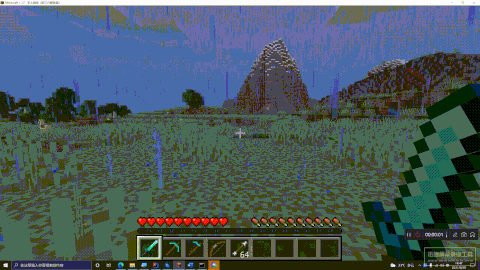

# SwapHotBar
a minecraft spigot plugin that change the relationship between the backpack and the hot bar, swap rows' of items in your backpack to your hot bar by simply pressing shift + mouse wheel

SpigotMC release: [SwapHotBar | SpigotMC - High Performance Minecraft](https://www.spigotmc.org/resources/swaphotbar.94333/)

MCBBS release: [\[机制\]蛋挞君的快捷物品栏切换——滚动快捷栏，更高效率，更多乐趣！[1.12-1.17]](https://www.mcbbs.net/thread-1215585-1-1.html)

## INTRODUCTION

There are some mods (for example Quark) that allow players to switch between multiple hot bars.

SwapHotBar is a plugin that implement this feature in a simple way, by changing the relationship between hot bar and backpack: each row of player's backpack can be seen as a hot bar, when the player is in the game, pressing Shift + mouse wheel can roll his/her items in the next row (or previous row) of backpack to hot bar for use, while the current hot bar's items will roll back to backpack, that form a cycle. Therefore, players are able to give each row a purpose, and switch between rows easily.

This mechanism is very convenient in the game. The application scenarios include but are not limited to: switching weapons and tools, switching tons of building blocks, quickly searching for an item, etc.

Just see the following sample inventory and gif to understand the usage:

## INSTALLATION

- Please fully test before use. If you have any problem, please give me feedback as soon as possible.
- If the inventory's slot numbers has been modified, this plugin may have problems.

## PERMISSIONS & COMMANDS

- Give players `shb.ignore` permission to disable the plugin on them, it is useful when some players don't like the feature.

  [**Fix in 1.4**] now ops can default use the feature of this plugin, you can also give ops `shb.ignore` to disable the feature on them.

- Use console command `/SHB reload` to reload configuration file

